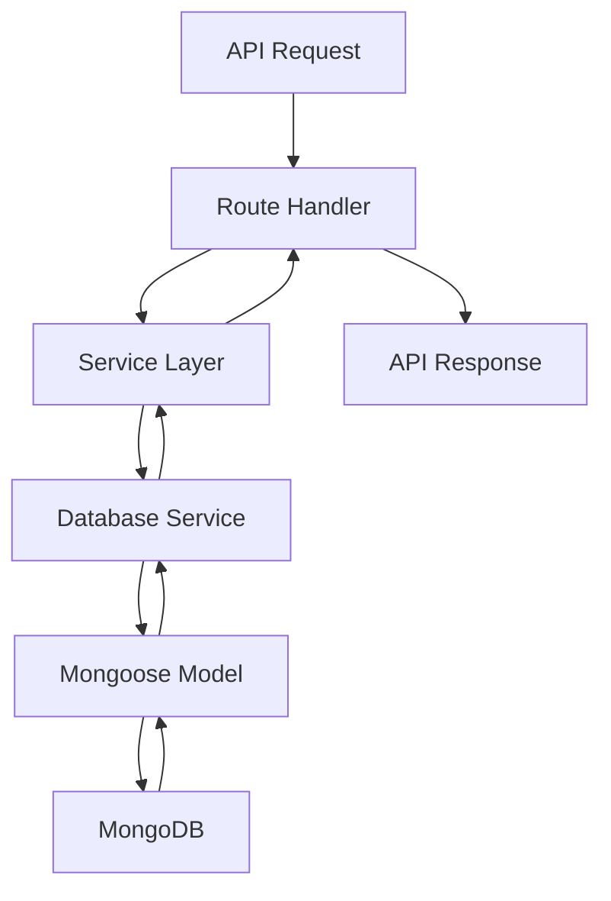

# 🏗️ Arquitectura del Sistema - Electric Automatic Chile

## 📋 Resumen Ejecutivo

Sistema de gestión de suministro eléctrico unificado usando **Mongoose** como ORM principal, con connection pooling optimizado, tipos TypeScript estrictos y servicios reutilizables.

## 🎯 Decisiones Arquitectónicas

### ✅ **MongoDB + Mongoose (Recomendado)**
- **Esquemas y validación automática**
- **Mejor integración con TypeScript**
- **Connection pooling integrado**
- **Middleware y hooks para business logic**
- **Population automática de referencias**
- **Queries más expresivos y seguros**

### ❌ **MongoDB Driver Directo (Descartado)**
- Más código boilerplate
- Validación manual
- Gestión manual de conexiones
- Menos type safety

## 🗂️ Estructura del Proyecto

```
electricautomaticchile/
├── 📁 lib/
│   ├── 📁 db/
│   │   └── mongoose.ts              # Sistema unificado de conexión
│   ├── 📁 types/
│   │   └── database.ts              # Tipos TypeScript estrictos
│   ├── 📁 services/
│   │   ├── database.service.ts      # Servicio base reutilizable
│   │   └── user.service.ts          # Servicio específico de usuarios
│   ├── 📁 models/                   # Modelos Mongoose
│   ├── 📁 utils/
│   │   └── logger.ts                # Sistema de logging
│   └── 📁 middleware/               # Middleware de seguridad
├── 📁 app/
│   └── 📁 api/                      # APIs Next.js
└── 📁 docs/                         # Documentación
```

## 🔧 Componentes Principales

### 1. **Sistema de Base de Datos Unificado**

#### `lib/db/mongoose.ts`
```typescript
// Connection pooling optimizado
const MONGODB_OPTIONS = {
  maxPoolSize: 10,        // Máximo 10 conexiones
  minPoolSize: 2,         // Mínimo 2 conexiones activas
  maxIdleTimeMS: 30000,   // Timeout de inactividad
  serverSelectionTimeoutMS: 5000,
  socketTimeoutMS: 45000,
  retryWrites: true,
  compressors: ['zlib']
};
```

**Características:**
- ✅ Connection pooling automático
- ✅ Reconexión automática
- ✅ Health checks integrados
- ✅ Cleanup automático al cerrar
- ✅ Logging detallado de conexiones

### 2. **Tipos TypeScript Estrictos**

#### `lib/types/database.ts`
```typescript
// Tipos base
export interface BaseDocument {
  _id: Types.ObjectId;
  createdAt: Date;
  updatedAt: Date;
}

// Tipos específicos
export interface IUser extends BaseDocument {
  numeroCliente: string;
  nombre: string;
  email: string;
  role: UserRole;
  esActivo: boolean;
  // ... más campos
}

// Utilidades de tipos
export type CreateInput<T> = Omit<T, '_id' | 'createdAt' | 'updatedAt'>;
export type UpdateInput<T> = Partial<CreateInput<T>>;
```

**Beneficios:**
- ✅ Type safety completo
- ✅ Autocompletado en IDE
- ✅ Detección temprana de errores
- ✅ Refactoring seguro

### 3. **Servicios Reutilizables**

#### `lib/services/database.service.ts`
```typescript
export class DatabaseService<T extends BaseDocument> {
  // CRUD operations
  async create(data: CreateInput<T>): Promise<T>
  async findById(id: string): Promise<T | null>
  async findMany(filter, pagination): Promise<{documents, pagination}>
  async updateById(id: string, update): Promise<T | null>
  async deleteById(id: string): Promise<T | null>
  
  // Utilidades
  async count(filter): Promise<number>
  async exists(filter): Promise<boolean>
  async search(term, filters, pagination)
  async aggregate(pipeline): Promise<any[]>
}
```

#### `lib/services/user.service.ts`
```typescript
export class UserService extends DatabaseService<UserDocument> {
  // Métodos específicos de usuario
  async createUser(userData): Promise<UserDocument>
  async findByEmail(email): Promise<UserDocument | null>
  async verifyPassword(user, password): Promise<boolean>
  async getUserStats(): Promise<any[]>
  // ... más métodos específicos
}
```

## 🔄 Flujo de Datos



## 🛡️ Seguridad y Performance

### Connection Pooling
- **Pool Size**: 2-10 conexiones
- **Idle Timeout**: 30 segundos
- **Socket Timeout**: 45 segundos
- **Compresión**: zlib habilitada

### Logging y Monitoreo
- **Desarrollo**: Debug + Info logs
- **Producción**: Solo Warn + Error + Security
- **Sanitización**: Datos sensibles automáticamente limpiados

### Type Safety
- **Strict TypeScript**: Configuración estricta
- **Runtime Validation**: Esquemas Mongoose
- **API Responses**: Tipadas y estandarizadas

## 📊 Patrones de Uso

### 1. **Crear un Nuevo Servicio**
```typescript
// 1. Definir tipos en database.ts
export interface IProduct extends BaseDocument {
  name: string;
  price: number;
  category: string;
}

// 2. Crear servicio específico
export class ProductService extends DatabaseService<ProductDocument> {
  async findByCategory(category: string) {
    return await this.findMany({ category });
  }
}

// 3. Usar en API
const productService = new ProductService(ProductModel);
const products = await productService.findByCategory('electronics');
```

### 2. **API Response Estandarizada**
```typescript
// Todas las APIs usan el mismo formato
return NextResponse.json({
  success: true,
  message: 'Operación exitosa',
  data: results,
  meta: {
    pagination: paginationInfo,
    timestamp: new Date().toISOString(),
    version: '1.0'
  }
});
```

### 3. **Manejo de Errores**
```typescript
try {
  const result = await service.operation();
  return service.createApiResponse(true, 'Éxito', result);
} catch (error) {
  logger.error('Error en operación', error);
  return service.createApiResponse(false, 'Error', null, error.message);
}
```

## 🚀 Beneficios de la Arquitectura

### ✅ **Desarrollo**
- **Reutilización**: Servicios base para todas las entidades
- **Consistencia**: Patrones uniformes en todo el proyecto
- **Productividad**: Menos código boilerplate
- **Mantenibilidad**: Separación clara de responsabilidades

### ✅ **Performance**
- **Connection Pooling**: Reutilización eficiente de conexiones
- **Lazy Loading**: Conexión solo cuando se necesita
- **Compresión**: Reducción de transferencia de datos
- **Índices**: Optimización automática en desarrollo

### ✅ **Seguridad**
- **Type Safety**: Prevención de errores en tiempo de compilación
- **Validación**: Esquemas Mongoose automáticos
- **Logging**: Trazabilidad completa de operaciones
- **Sanitización**: Limpieza automática de datos sensibles

### ✅ **Escalabilidad**
- **Modular**: Fácil agregar nuevas entidades
- **Extensible**: Servicios especializados heredan funcionalidad base
- **Configurable**: Parámetros de conexión ajustables
- **Monitoreable**: Health checks y métricas integradas

## 📈 Métricas y Monitoreo

### Connection Health
```typescript
const health = await checkDatabaseHealth();
// {
//   isHealthy: true,
//   details: {
//     readyState: 1,
//     poolSize: 5,
//     connectionCount: 3,
//     collections: 8
//   }
// }
```

### Performance Tracking
- **Connection Count**: Número de conexiones activas
- **Query Performance**: Tiempo de respuesta de queries
- **Pool Utilization**: Uso del pool de conexiones
- **Error Rates**: Tasa de errores por operación

## 🔮 Próximos Pasos

1. **Implementar más servicios específicos** (Devices, Messages, etc.)
2. **Agregar caching con Redis** para queries frecuentes
3. **Implementar índices de búsqueda** para texto completo
4. **Agregar métricas de performance** detalladas
5. **Implementar backup automático** de datos críticos

---

## 📞 Soporte

Para dudas sobre la arquitectura:
- **Documentación**: `/docs/`
- **Ejemplos**: `/examples/`
- **Tests**: `/tests/`

**Última actualización**: Diciembre 2024 